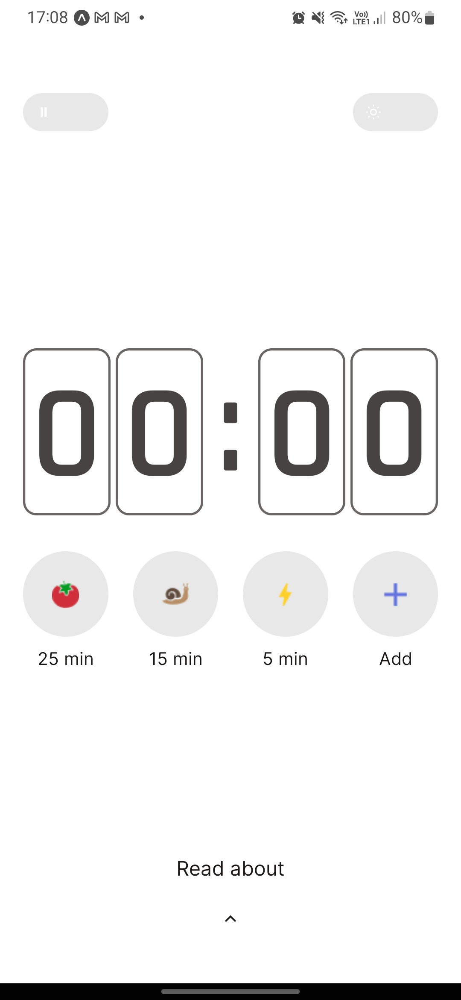
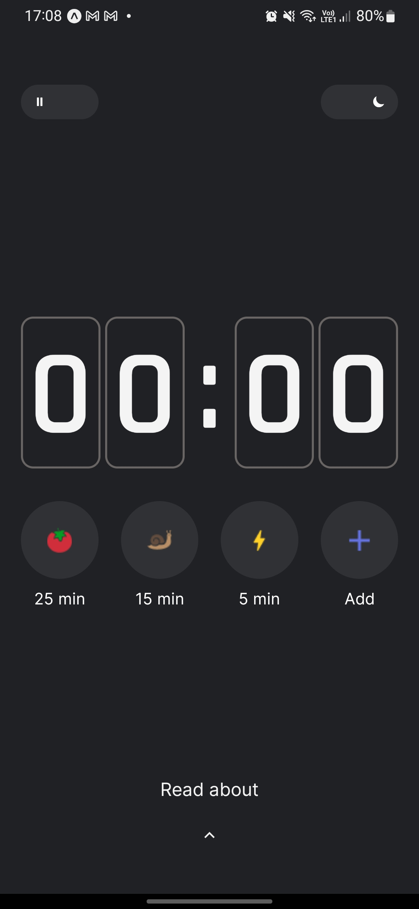

# Pomodoro

Esse repositório consiste no projeto Pomodoro. Consiste em um aplicativo mobile que implementa o método de estudo Pomodoro.

## Tela Home nos modos light e dark
<div align='center'>
  
  
</div>

## Recursos utilizados

- Typescript
- Expo
- React Native
- Nativewind (Tailwind)
- Async Storage
- Moti

## Para testar o app, siga os seguintes passos:

- Instalar o expo
  ```bash
  npm install -g expo
  ```
- Clonar o respositório
  ```bash
  git clone https://github.com/matosgabriel/pomodoro.git
  ```
- Instalar as dependências do projeto
  ```bash
  yarn install
  ```
- Executar o app
  ```bash
  yarn start
  ```
- Acessar o app no celular escaneando o QR code pelo aplicativo [Expo Go](https://expo.dev/client).
